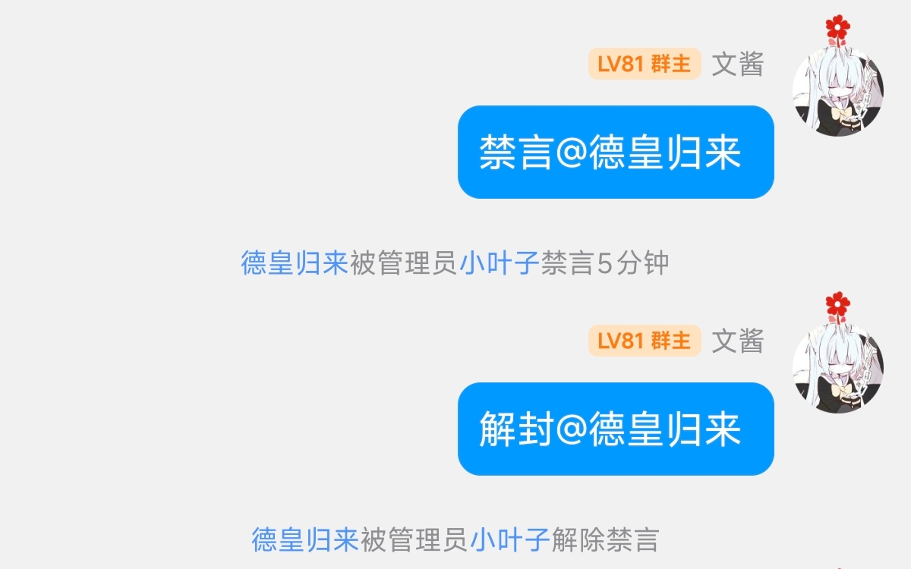
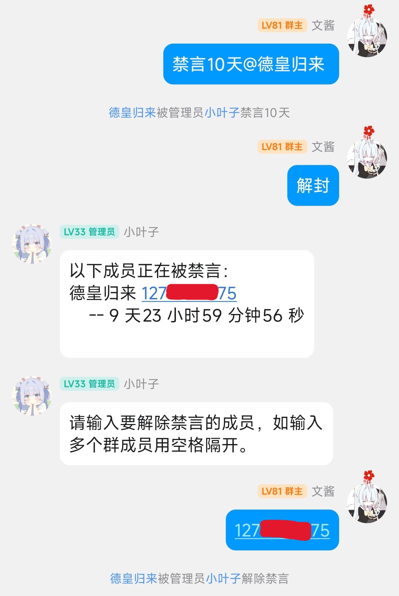
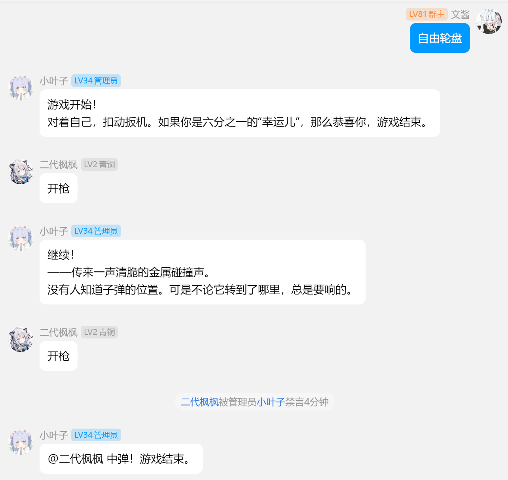

<div align="center">

<a href="https://v2.nonebot.dev/store">
  
</a>

<p>
  
</p>

# NoneBot-Plugin-Russian-Ban

✨ 轮盘禁言小游戏 ✨

[](https://www.python.org/)
[](https://python-poetry.org/)
[](./LICENSE)
[](https://pypi.python.org/pypi/nonebot_plugin_russian_ban)
[](https://pypi.python.org/pypi/nonebot_plugin_russian_ban)
<br />

[](https://qm.qq.com/q/3vpD9Ypb0c)

</div>

# 安装

使用 nb-cli 安装

```bash
nb plugin install nonebot_plugin_russian_ban
```

# 介绍

此功能需要给 bot 设置为管理员，否则会提示 bot 没有权限。

效果：

**禁言与解封**



**指定时间禁言与使用 QQ 号解封**



**自由轮盘效果**



## 开始游戏

**指令**：`轮盘禁言` `自由轮盘`

开启群内随机 ban 人游戏

**指令**：`拨动滚轮` `重新装弹`

重置子弹的位置。

**指令**：`开枪`

顾名思义，开枪。

**指令【管理员，群主，超管】**：`开启自由轮盘` `关闭自由轮盘`

控制当前群内可否发起自由轮盘游戏，【管理员，群主，超管】可无视此设定在群内发起轮盘。

## 快捷禁言/解禁

此项功能是为轮盘禁言打扫战场用。

**指令【管理员，群主，超管】**：`禁言 @name`

给@的成员禁言 5 分钟，可@多人。如果给群友设置过代号，可以通过代号快捷禁言

**指令【管理员，群主，超管】**：`禁言一小时 @name` `禁言10分钟 @name` `禁言一个月 @name`

给@的成员相应的时间，可@多人

**指令【管理员，群主，超管】**：`解封` `解封 @name`

给@的成员解除禁言。可@多人。如果给群友设置过代号，可以通过代号快捷解除禁言。

如果没有指定成员会返回当前被封成员列表。之后可以根据提示进一步设置。
